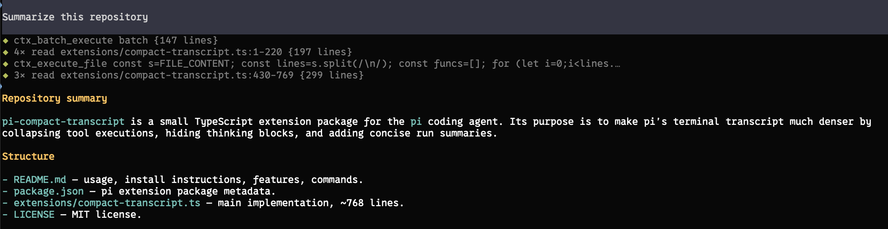

# pi-compact-transcript

A compact transcript extension for [pi](https://pi.dev).

| Without the extension | With the extension |
|---|---|
|  |  |

What it does:

- Collapses every tool call/result into a one-line preview, including custom/external tools added by other extensions.
- Each tool row carries a status diamond: blinking gray `◆` while the tool runs, solid green `◆` on success, solid red `◆` on failure.
- Consecutive uses of the same tool coalesce into a single row, e.g. `◆ 4× read src/foo.ts {12 lines · 8s}`; a different tool starts a new row with its own diamond.
- Tool rows show durations when they take a second or longer; grouped rows show the total.
- Failed tools always get their own visible row (red diamond) and end the current burst.
- Tool rows render dimmed so assistant text stands out.
- Hidden thinking blocks are suppressed entirely — no `Thinking...` markers.
- Each agent run ends with a one-line summary, e.g. `Read 6 files, edited 2, ran 3 commands, 1 failed · 42s`.
- Unknown tools preview their most meaningful string argument (command, code, query, path, url, ...) instead of dumping raw JSON args.
- Expanded tool output still falls back to pi's original renderer, so you can use pi's normal tool expansion when details matter.
- Minimizes vertical space so long agent runs do not scroll away as quickly.

## Install from GitHub

```bash
pi install git:github.com/avhagedorn/pi-compact-transcript
```

Or try it for one run:

```bash
pi -e git:github.com/avhagedorn/pi-compact-transcript
```

Reload or restart pi after installing:

```text
/reload
```

## Install from npm

Once published to npm:

```bash
pi install npm:pi-compact-transcript
```

## Recommended settings

The extension works best with hidden thinking and no output padding:

```json
{
  "hideThinkingBlock": true,
  "outputPad": 0
}
```

Set these in `~/.pi/agent/settings.json`, or use `/settings` in pi.

Thinking suppression only applies when `hideThinkingBlock` is on; with it off, pi renders thinking traces normally.

## Commands

```text
/compact-transcript          # toggle on/off
/compact-transcript on|off   # set explicitly
/compact-transcript status   # show current state
```

Toggling applies to the visible transcript immediately — existing rows re-render, no reload needed. The pre-0.5 mode names (`balanced`, `aggressive`, `debug`, `disabled`) are accepted as legacy aliases for `on`/`off`.

## Notes

This extension changes display only. Tool execution is still handled by pi and any other extensions that registered or override tools.

For built-in and extension tools, compact rendering uses pi's public exported TUI components where available. The cross-tool burst compaction and thinking suppression still rely on pi's current TUI component internals, so if pi changes those internals in a future release, the extension falls back to pi's normal rendering behavior for the affected rows.
