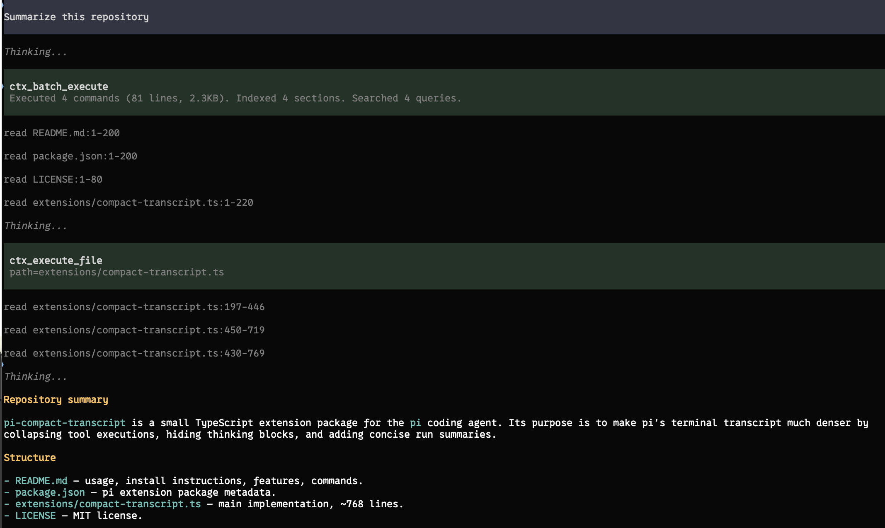

# pi-compact-transcript

A compact transcript extension for [pi](https://pi.dev).

| With the extension | Without the extension|
|---|---|
|  |  |

What it does:

- Collapses every tool call/result into a dimmed one-line preview with a status diamond: blinking gray `◆` while running, green on success, red on failure. Durations show at a second or longer.
- Consecutive uses of the same tool coalesce into a single row, e.g. `◆ 4× read src/foo.ts {12 lines · 8s}`. Failed tools always get their own visible row.
- Each agent run ends with a one-line summary, e.g. `Read 6 files, edited 2, ran 3 commands, 1 failed · 42s`.
- Suppresses `Thinking...` markers when thinking is hidden.
- Works with custom/external tools from other extensions; unknown tools preview their most meaningful string argument (command, code, query, path, url, ...) instead of raw JSON.
- Expanded tool output still uses pi's original renderer, so pi's normal tool expansion works when details matter.

## Install

```bash
pi install npm:pi-compact-transcript
```

Or from GitHub:

```bash
pi install git:github.com/avhagedorn/pi-compact-transcript
```

Or try it for one run:

```bash
pi -e git:github.com/avhagedorn/pi-compact-transcript
```

Reload or restart pi after installing:

```text
/reload
```

## Recommended settings

Works best with hidden thinking and no output padding — set in `~/.pi/agent/settings.json` or via `/settings`:

```json
{
  "hideThinkingBlock": true,
  "outputPad": 0
}
```

Thinking suppression only applies when `hideThinkingBlock` is on; with it off, pi renders thinking traces normally.

## Commands

```text
/compact-transcript          # toggle on/off
/compact-transcript on|off   # set explicitly
/compact-transcript status   # show current state
```

Toggling re-renders the visible transcript immediately — no reload needed. Pre-0.5 mode names (`balanced`, `aggressive`, `debug`, `disabled`) are accepted as legacy aliases for `on`/`off`.

## Notes

This extension changes display only — tool execution is still handled by pi and any other extensions that registered or override tools.

Compact rendering uses pi's public exported TUI components where available. Burst compaction and thinking suppression rely on pi's current TUI internals; if a future pi release changes those, the affected rows fall back to pi's normal rendering.
